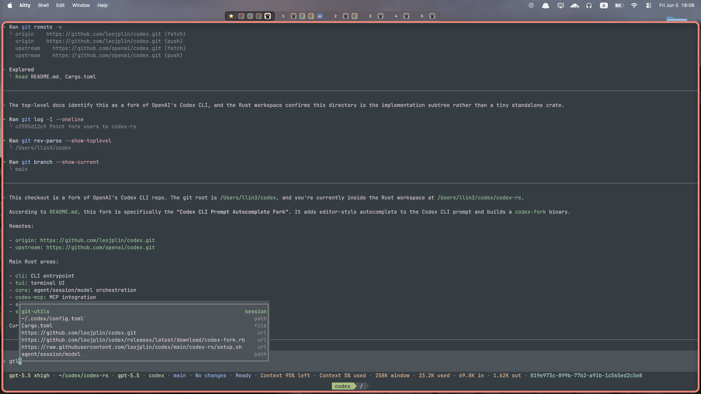

# Codex CLI Prompt Autocomplete Fork

<p align="center">
  
</p>

This fork adds editor-style autocomplete to the Codex CLI prompt input.

The goal is to make the prompt behave closer to a code editor: completions appear near the cursor, update as the user keeps typing, can be cycled with `Tab`, and are accepted with `Enter`.

## Installation

### Latest Release

Install the latest macOS ARM64 release:

```bash
curl -fsSL https://raw.githubusercontent.com/leojplin/codex/main/codex-rs/setup.sh | bash
```

This installs to `~/.local/bin/codex-fork` by default and does not replace an existing official `codex` command.

To install somewhere else:

```bash
curl -fsSL https://raw.githubusercontent.com/leojplin/codex/main/codex-rs/setup.sh | INSTALL_DIR="$HOME/.cargo/bin" bash
```

Check that the fork is installed:

```bash
~/.local/bin/codex-fork
```

### Homebrew

Install the latest release with Homebrew:

```bash
brew install --formula https://github.com/leojplin/codex/releases/latest/download/codex-fork.rb
```

### Build From Source

Run these commands from the `codex-rs` directory in this fork.

If you do not have Rust installed yet:

```bash
cd path/to/codex-rs
xcode-select --install
curl --proto '=https' --tlsv1.2 -sSf https://sh.rustup.rs | sh
source "$HOME/.cargo/env"
cargo install --locked --path cli --bin codex-fork --force
```

If you already have Rust installed:

```bash
cd path/to/codex-rs
cargo install --locked --path cli --bin codex-fork --force
```

This installs to `~/.cargo/bin/codex-fork`.

### Creating A Release

The GitHub release workflow builds only the macOS ARM64 binary.

Create and push a tag to publish a release:

```bash
git tag codex-fork-v0.1.0
git push origin codex-fork-v0.1.0
```

The workflow publishes:

- `codex-fork-aarch64-apple-darwin.tar.gz`
- `SHA256SUMS`
- `codex-fork.rb`

## Usage

Autocomplete is enabled by default. In the prompt, type part of a word and press `Tab` to cycle candidates. Press `Enter` to accept the selected candidate.

Optional config in `~/.codex/config.toml`:

```toml
[tui.prompt_autocomplete]
enabled = true
dictionary = true
```

Set `enabled = false` to turn autocomplete off. Set `dictionary = false` to keep session completions but remove dictionary completions.

Run from this repo without installing:

```bash
cd path/to/codex-rs
cargo run -p codex-cli --bin codex-fork
```

Build it first if you want to check compilation:

```bash
cd path/to/codex-rs
cargo build -p codex-tui
```

## Feature Summary

- Shows prompt completions while typing.
- Uses completion candidates from the current Codex session.
- Detects ordinary words, filenames, file paths, and URLs from session output.
- Adds full English dictionary completions.
- Supports fuzzy matching, with exact, prefix, and substring matches ranked above fuzzy matches.
- Lets `Tab` cycle forward through candidates.
- Lets `Shift+Tab`, `Up`, or `Ctrl+P` move backward.
- Lets `Down` or `Ctrl+N` move forward.
- Lets `Enter` accept the selected completion.
- Lets `Esc` dismiss the current completion.
- Keeps completion state in the bottom pane instead of inside the composer.
- Replaces only the active token in the composer when a completion is accepted.
- Can be enabled or disabled from `config.toml`.
- Can include or exclude dictionary completions from `config.toml`.

## Configuration

Prompt autocomplete is enabled by default. Dictionary completions are also enabled by default.

To configure it explicitly:

```toml
[tui.prompt_autocomplete]
enabled = true
dictionary = true
```

To disable prompt autocomplete entirely:

```toml
[tui.prompt_autocomplete]
enabled = false
```

To keep session, filename, path, and URL completions but remove dictionary completions:

```toml
[tui.prompt_autocomplete]
dictionary = false
```

## Completion Sources

The session completion index collects candidates from text that appears during the current session.

It extracts:

- Words
- Filenames
- File paths
- URLs

Dictionary completions come from a static English word list included in the binary. The dictionary assets are precomputed and loaded with `include_str!` and `include_bytes!`, so Codex does not rebuild the dictionary index every time it starts.

## Search Behavior

The completion search combines session candidates and dictionary candidates.

Session candidates are ranked first. Dictionary candidates are only added when the popup still has room after session matches. The popup currently caps the result list at 8 candidates.

The ranking prefers:

1. Exact matches
2. Prefix matches
3. Substring matches
4. Fuzzy matches

For session data, the index stores normalized keys, frequency, last-seen order, candidate type, length, and ASCII character masks. This avoids unnecessary fuzzy work for candidates that cannot plausibly match the current query.

For dictionary data, literal and fuzzy search no longer scan the full dictionary. The implementation uses precomputed pair indexes:

- Literal dictionary search chooses the rarest query bigram and scans only that posting list.
- Fuzzy dictionary search chooses the rarest query letter pair, filters candidates by length and letter mask, then runs `neo_frizbee` only over the reduced candidate set.

Dictionary debounce has been removed. Dictionary search now runs immediately with the rest of completion search.

When `tui.prompt_autocomplete.enabled = false`, completion indexing, popup search, popup key handling, and terminal overlay rendering are disabled. When `tui.prompt_autocomplete.dictionary = false`, only the dictionary source is skipped.

## Popup UI

The popup is no longer owned by the composer layout.

The composer reports:

- The current completion query
- The token range that should be replaced
- The cursor position

The bottom pane owns the popup state and renders completion UI separately from the composer. This lets the popup behave as an overlay instead of increasing the composer height.

The popup is rendered as a bordered popup sized to its contents. Candidate type labels such as `session`, `dict`, `file`, `path`, and `url` are right-aligned inside the popup.

## Terminal Overlay Rendering

Ratatui normally renders only the active viewport used by the live chat widget. To let completions overlap transcript content above the composer, the popup is rendered after the normal Ratatui frame as a raw terminal overlay.

The render flow is:

1. Draw the normal chat widget frame.
2. Capture the prompt cursor position.
3. Build an offscreen Ratatui buffer for the completion popup using absolute terminal coordinates.
4. Draw that buffer directly to the terminal.
5. Track the previous popup rectangle.
6. When the popup moves or closes, redraw the affected transcript rows from the stored transcript cells.

This keeps the composer height tied to the prompt itself while allowing the popup to overlap the transcript and status area.

## Important Files

- `tui/src/bottom_pane/completion_index.rs`: candidate extraction, session index, dictionary search, fuzzy ranking.
- `tui/src/bottom_pane/completion_popup.rs`: popup state, selection, and rendering.
- `tui/src/bottom_pane/prompt_autocomplete.rs`: prompt autocomplete controller, config gates, key handling, popup sync, and overlay buffer creation.
- `tui/src/bottom_pane/chat_composer.rs`: exposes completion context and token replacement APIs.
- `tui/src/bottom_pane/mod.rs`: thin hooks from composer activity, history ingestion, and rendering into the prompt autocomplete controller.
- `tui/src/chatwidget/rendering.rs`: exposes the completion overlay buffer from the chat widget.
- `tui/src/app.rs`: captures the prompt cursor position after the normal frame and calls the overlay hook.
- `tui/src/app/prompt_autocomplete_overlay.rs`: draws the raw terminal overlay and restores affected transcript rows.
- `tui/src/custom_terminal.rs`: writes overlay buffers directly to the terminal.
- `tui/assets/completion/`: static dictionary words and precomputed dictionary indexes.

## Build

Compile the TUI package:

```bash
cargo build -p codex-tui
```

Run the CLI manually:

```bash
cargo run -p codex-cli --bin codex-fork
```

## Manual Verification

In a Codex session:

1. Generate transcript output that includes words, file paths, filenames, and URLs.
2. Start typing a partial token in the prompt.
3. Confirm the popup appears near the cursor.
4. Confirm session candidates appear immediately.
5. Type a partial English word and confirm dictionary candidates appear immediately.
6. Press `Tab` to cycle through candidates.
7. Press `Enter` to accept the selected candidate.
8. Confirm only the active token is replaced.
9. Press `Esc` and confirm the popup is dismissed.
